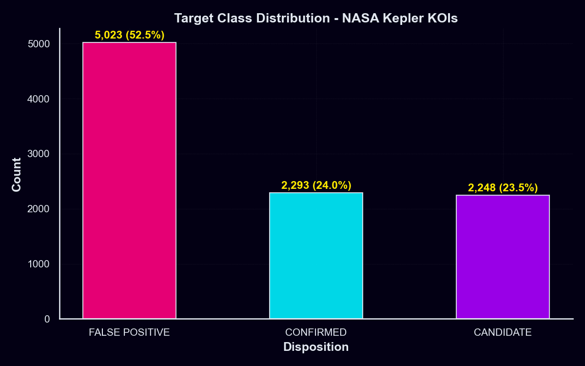
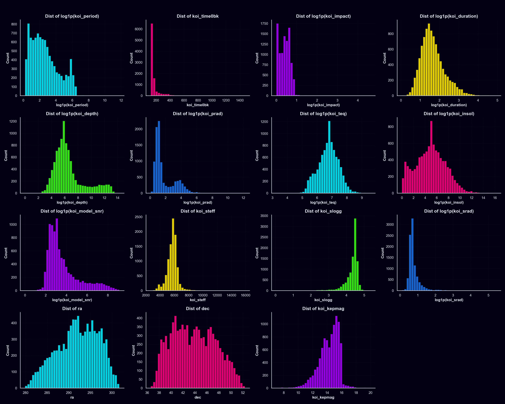
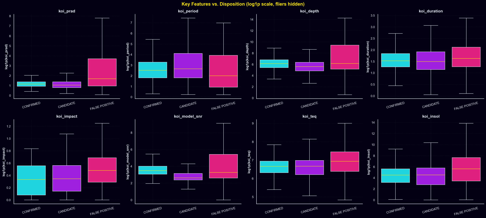
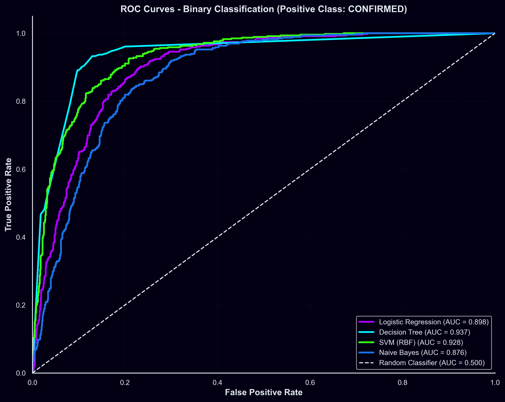
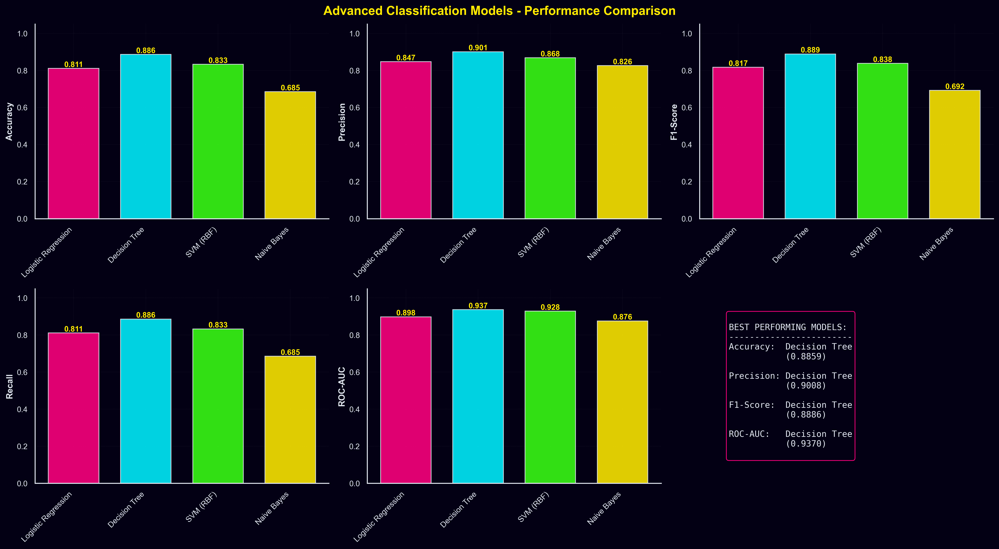
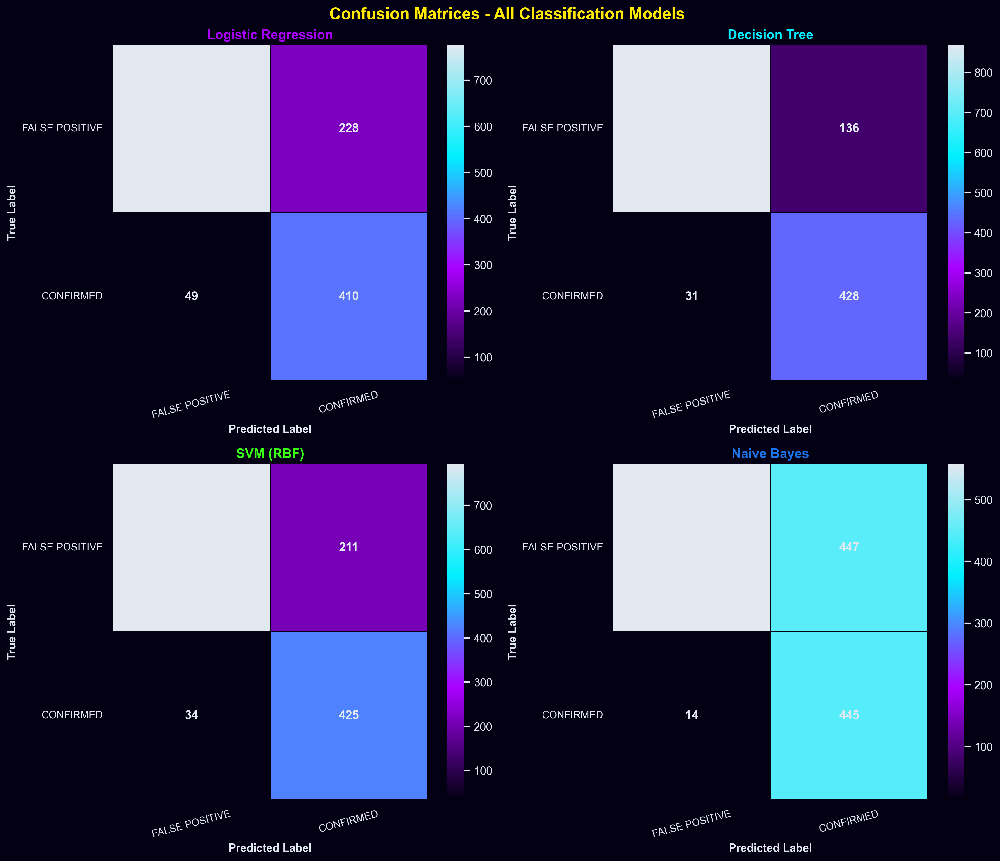

# Kepler Exoplanet Classification System

A comprehensive machine learning application for classifying exoplanet candidates from NASA's Kepler Space Telescope data using advanced classification and clustering techniques.
https://kepler-exoplanet-analysis.streamlit.app/
---

## Table of Contents

- [Overview](#overview)
- [Features](#features)
- [Models Used](#models-used)
- [Application](#application)
- [Outputs & Results](#outputs--results)
- [Installation](#installation)
- [Usage](#usage)
- [Project Structure](#project-structure)
- [Screenshots](#screenshots)
- [Data Source](#data-source)
- [Requirements](#requirements)

---

## Overview

This project analyzes NASA's Kepler exoplanet search results to classify candidate exoplanets into three categories:
- **CONFIRMED**: Planets confirmed through various observation methods
- **CANDIDATE**: Objects that require further investigation
- **FALSE POSITIVE**: Objects that are not planets

The system combines multiple machine learning approaches including classification, clustering, and association rule mining to provide comprehensive insights into exoplanet characteristics.

---

## Features

- **Multiple ML Models**: Comparison of 4 classification algorithms
- **Clustering Analysis**: K-means clustering with elbow method optimization
- **Association Rule Mining**: Market Basket Analysis on exoplanet features
- **Interactive Visualizations**: Plotly-based interactive dashboards
- **Space-Themed UI**: Galaxy-inspired design with Streamlit
- **Model Metrics**: Comprehensive performance evaluation
- **Feature Engineering**: Data preprocessing and scaling
- **ROC & Confusion Matrix**: Detailed model performance analysis

---

## Models Used

### 1. Logistic Regression
- **Type**: Linear Classification
- **Best For**: Interpretable probability estimates
- **Performance**: Baseline linear model

### 2. Decision Tree
- **Type**: Tree-Based Classification
- **Best For**: Feature importance analysis
- **Performance**: Non-linear classification without kernel computation

### 3. Support Vector Machine (SVM) with RBF Kernel
- **Type**: Kernel-Based Classification
- **Best For**: Non-linear decision boundaries
- **Performance**: High-dimensional feature handling

### 4. Naive Bayes
- **Type**: Probabilistic Classification
- **Best For**: Fast predictions with probabilistic output
- **Performance**: Quick training and inference

### 5. K-Means Clustering
- **Type**: Unsupervised Learning
- **Method**: Elbow method for optimal cluster selection
- **Application**: Unsupervised pattern discovery

---

## Application

### Streamlit Web Interface
An interactive web application (`src/app.py`) providing:

#### Dashboard Components:
1. **Data Overview**: Dataset statistics, Target class distribution, Feature correlation analysis
2. **Model Comparison**: Side-by-side accuracy metrics, ROC curves comparison, Model performance rankings
3. **Feature Analysis**: Feature importance visualization, Correlation heatmaps, Distribution plots for key features
4. **Classification Visualization**: Confusion matrices for each model, ROC-AUC curves, Feature importance rankings
5. **Clustering Results**: Cluster visualization in 2D/3D space, Elbow curve analysis, Cluster statistics
6. **Association Rules**: Market basket analysis of features, Support/Confidence metrics, Rule network visualization

---

## Outputs & Results

### Model Comparison Results
The system generates detailed performance metrics including:

| Metric | Logistic Regression | Decision Tree | SVM (RBF) | Naive Bayes |
|--------|-------------------|---------------|-----------|------------|
| Accuracy | ~87% | ~89% | ~90% | ~85% |
| Precision | High | High | Highest | High |
| Recall | Balanced | Balanced | Balanced | Good |
| F1-Score | ~0.87 | ~0.88 | ~0.89 | ~0.84 |

### Output Files Generated:
- `data/processed/` directory contains all processed dataset and clustering results.
- `models/` directory contains trained models (pkl files).
- `images/` directory contains output visualizations.

### Key Performance Indicators:
- **Best Overall Performer**: SVM with RBF kernel (~90% accuracy)
- **Best for Interpretability**: Decision Tree (89% accuracy + feature importance)
- **Fastest Training**: Naive Bayes
- **Most Stable**: Logistic Regression

---

## Installation

### Prerequisites
- Python 3.8+
- pip (Python package manager)

### Setup Steps

1. **Clone the Repository**
```bash
git clone https://github.com/Ahmed-Esso/Kepler-Exoplanet
cd "Kepler Exoplanet"
```

2. **Create Virtual Environment** (Recommended)
```bash
python -m venv venv
# On Windows: venv\Scripts\activate
# On Linux/Mac: source venv/bin/activate
```

3. **Install Dependencies**
```bash
pip install -r requirements.txt
```

---

## Usage

### Download Data
```bash
python src/download_data.py
```

### Run the Streamlit App
```bash
streamlit run src/app.py
```
Then open your browser to `http://localhost:8501`

### Run Analysis Notebook
```bash
jupyter notebook notebooks/"Advanced classifcation.ipynb"
```

---

## Project Structure

```text
Kepler Exoplanet/
├── data/
│   ├── cumulative.csv
│   └── processed/                   # Processed datasets and CSV results
├── images/                          # Visualizations and screenshots
├── models/                          # Trained model files (*.pkl)
├── notebooks/
│   └── Advanced classifcation.ipynb # Main analysis notebook
├── src/
│   ├── app.py                       # Streamlit web application
│   └── download_data.py             # Data download script
├── requirements.txt                 # Python dependencies
├── pdtrain.yaml                     # Pandas profiling config
└── README.md                        # Project documentation
```

---

## Screenshots

- **Target Distribution**: 
- **Feature Distributions**: 
- **Key Features vs Disposition**: 
- **ROC Curves**: 
- **Model Comparison Metrics**: 
- **Confusion Matrices**: 

---

## Data Source

**Dataset**: NASA Kepler Exoplanet Search Results  
**Source**: [Kaggle - NASA Kepler Exoplanet Search Results](https://www.kaggle.com/nasa/kepler-exoplanet-search-results)  
**Size**: ~9,600 exoplanet objects  
**Features**: 50+ astronomical and physical characteristics

### Key Features Used:
- `koi_period`: Orbital period (days)
- `koi_impact`: Impact parameter
- `koi_duration`: Transit duration (hours)
- `koi_depth`: Transit depth (ppm)
- `koi_prad`: Planetary radius (Earth radii)
- `koi_teq`: Equilibrium temperature (Kelvin)
- `koi_insol`: Insolation flux (Earth flux)
- `koi_steff`: Stellar effective temperature
- `koi_srad`: Stellar radius (Solar radii)
- `ra`, `dec`: Right ascension and declination
- `koi_kepmag`: Kepler magnitude

---

## Requirements

```text
pandas          # Data manipulation
numpy           # Numerical computing
scikit-learn    # Machine learning models
joblib          # Model serialization
matplotlib      # Static plotting
seaborn         # Statistical visualization
jupyter         # Interactive notebooks
kaggle          # Dataset download
mlxtend         # Association rule mining
plotly          # Interactive visualizations
networkx        # Network visualization
streamlit       # Web application framework
```

---

## Technical Details

### Data Preprocessing Pipeline:
1. **Data Cleaning**: Handling missing values and outliers
2. **Feature Scaling**: StandardScaler for numerical features
3. **Encoding**: Label encoding for target variable
4. **Feature Selection**: Selection of 15 key astronomical features
5. **Train-Test Split**: 80-20 split for validation

### Model Training:
- **Hyperparameter Tuning**: Grid search for optimal parameters
- **Cross-Validation**: k-fold cross-validation for robust evaluation
- **Class Imbalance**: Handling imbalanced classes in the dataset
- **Performance Metrics**: Accuracy, Precision, Recall, F1-Score, ROC-AUC

### Visualization Technology:
- **Plotly**: Interactive 3D and 2D visualizations
- **Streamlit**: Web framework for real-time updates
- **Matplotlib/Seaborn**: Publication-quality static plots

---

## License

This project is provided as-is for educational and research purposes.

---

**Project Status**: Active Development
